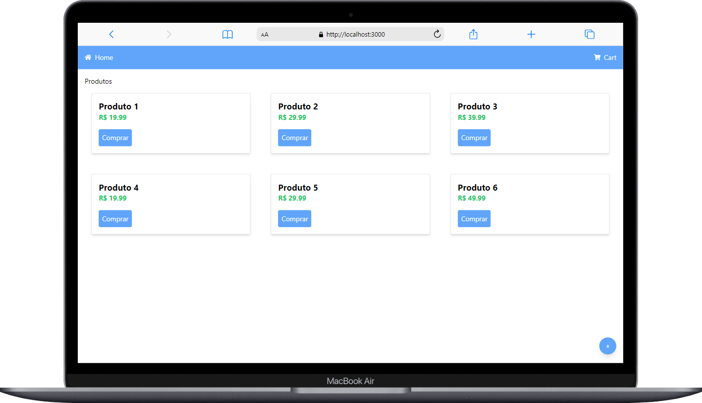

# E-commerce Project

Este é um projeto de e-commerce desenvolvido em React. O aplicativo permite que os usuários visualizem produtos, adicionem ao carrinho e selecionem métodos de pagamento, como Pix, Cartão e Boleto.

## Funcionalidades

- **Listagem de Produtos**: Exibe uma grade de produtos com imagem, nome e preço.
- **Carrinho de Compras**: Permite adicionar e remover produtos do carrinho.
- **Modal de Pagamento**: Oferece opções de pagamento com redirecionamento para páginas específicas.
- **Responsividade**: O design é responsivo, adequado para dispositivos móveis e desktop.

## Tecnologias Utilizadas

- **React**: Biblioteca JavaScript para construir interfaces de usuário.
- **React Router**: Para gerenciamento de rotas e navegação.
- **Font Awesome**: Para ícones utilizados nas opções de pagamento.
- **Tailwind CSS**: Para estilização rápida e responsiva.



### Personalizações

Sinta-se à vontade para personalizar as partes que mencionam seu nome de usuário, o nome do repositório e qualquer outra informação específica que você gostaria de incluir. Isso garantirá que o README reflita exatamente o que você deseja compartilhar sobre o seu projeto!

## Aviso

**Antes de baixar e executar este projeto, é essencial que você tenha o Node.js e o npm instalados em sua máquina.** 

Você pode verificar se já tem o Node.js instalado executando o seguinte comando no terminal:

```bash
node -v

### Sugestões para o README

Adicione esta seção logo após a introdução ou antes dos pré-requisitos, assim fica claro que é uma condição necessária para rodar o projeto.

Se precisar de mais ajuda ou detalhes, é só avisar!
